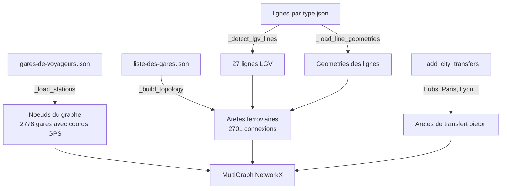
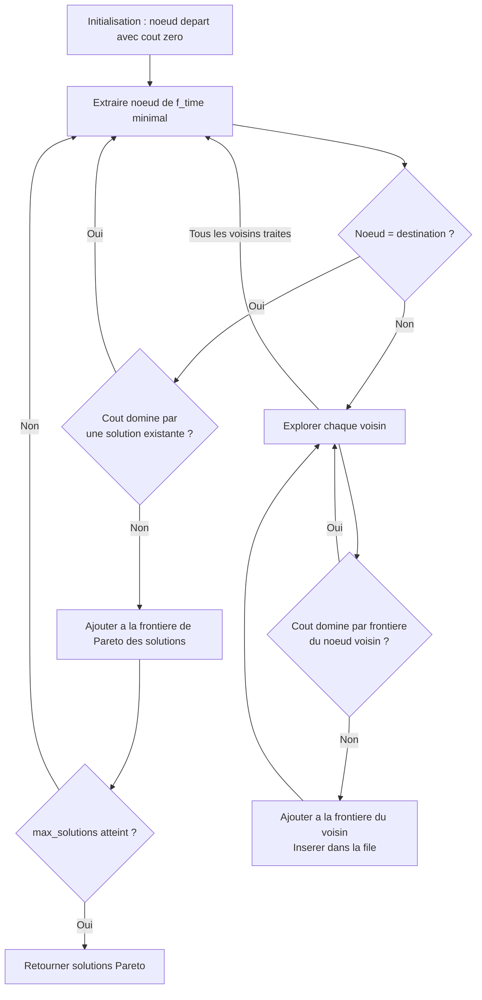
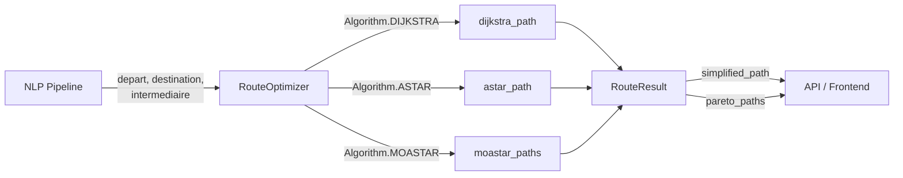
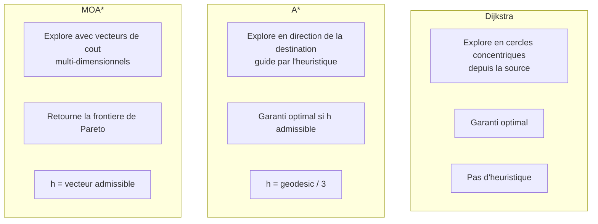

# Pathfinding - Documentation technique

## Table des matieres

1. [Construction du graphe ferroviaire](#1-construction-du-graphe-ferroviaire)
2. [Algorithmes de pathfinding](#2-algorithmes-de-pathfinding)
3. [Route Optimizer](#3-route-optimizer)
4. [Simplification de chemin](#4-simplification-de-chemin)
5. [Visualisation](#5-visualisation)
6. [Analyse de complexite](#6-analyse-de-complexite)

---

## 1. Construction du graphe ferroviaire

### Sources de donnees

Le graphe est construit a partir de 3 fichiers SNCF open data :

| Fichier | Contenu | Usage |
|---------|---------|-------|
| `gares-de-voyageurs.json` | Gares voyageurs avec coordonnees GPS | Noeuds du graphe |
| `liste-des-gares.json` | Mapping gare <-> ligne avec point kilometrique (pk) | Aretes du graphe |
| `lignes-par-type.json` | Lignes ferroviaires avec type et geometrie | Detection LGV + visualisation |

### Approche hybride : topologique + geometrique

La construction du graphe combine deux approches complementaires :

**Topologique (connexions)** : Les connexions entre gares sont determinees par leur appartenance commune a une ligne ferroviaire. Chaque gare dans `liste-des-gares.json` est associee a un `code_ligne` et a un `pk` (point kilometrique). Les gares partageant la meme ligne sont triees par pk croissant, puis les gares consecutives sont connectees par une arete. La distance entre deux gares est calculee par la difference de pk (ex: pk 602.834 - pk 590.200 = 12.634 km).

**Geometrique (coordonnees)** : Les coordonnees GPS des gares (issues de `gares-de-voyageurs.json`) servent a deux choses :
- L'heuristique des algorithmes A* et MOA* (distance a vol d'oiseau vers la destination)
- Le fallback de distance quand la difference de pk est aberrante (< 0.1 km ou > 500 km)

### Gestion des LGV

Les lignes a grande vitesse sont detectees par leur nom dans `lignes-par-type.json` (contient "LGV" ou "VITESSE"). Le systeme detecte **27 lignes LGV** sur l'ensemble du reseau.

Sur ces lignes, le poids des aretes est divise par 3 (`weight = dist_km / 3.0`) pour refleter le fait qu'un TGV parcourt la meme distance ~3x plus vite qu'un train classique (280 km/h vs 80 km/h). Cela permet aux algorithmes de pathfinding de favoriser naturellement les itineraires LGV.

### Correspondances urbaines

Dans les grandes villes (Paris, Lyon, Lille, Marseille, Bordeaux, Nantes), plusieurs gares coexistent sans etre reliees par des lignes ferroviaires directes (ex: Paris Gare de Lyon et Paris Montparnasse). Des aretes de transfert pieton sont ajoutees entre toutes les gares d'un meme hub distantes de moins de 8 km, avec un poids fixe de 15 (equivalent a ~15 km de trajet, ce qui penalise legerement les correspondances).

### Caracteristiques du graphe

Le graphe resultant presente les caracteristiques suivantes :

| Metrique | Valeur |
|----------|--------|
| Noeuds (gares voyageurs) | **2 778** |
| Aretes (connexions ferroviaires) | **2 701** |
| Lignes LGV detectees | **27** |
| Aretes de transfert | Variables selon les hubs |
| Type de graphe | MultiGraph NetworkX |

Le graphe est un **MultiGraph** NetworkX : plusieurs aretes sont possibles entre deux memes noeuds, car deux gares peuvent etre reliees par plusieurs lignes differentes.

Chaque **noeud** porte :
- `name` : nom de la gare (ex: "Paris Gare de Lyon")
- `pos` : coordonnees GPS (latitude, longitude)

Chaque **arete** porte :
- `weight` : cout pour le pathfinding (dist_km, divise par 3 pour les LGV)
- `dist_km` : distance reelle en km
- `speed` : vitesse estimee (280 km/h LGV, 80 km/h classique, 5 km/h transfert)
- `line` : code de la ligne ferroviaire (ou "TRANSFERT" pour les correspondances)
- `type` : "TRAIN" ou "WALK"
- `geometry` : trace geometrique de la ligne (pour la visualisation cartographique)

### Architecture de construction



---

## 2. Algorithmes de pathfinding

Le systeme implemente trois algorithmes de pathfinding, tous codes **from scratch** (sans utiliser les fonctions de recherche de chemin de NetworkX) a l'aide d'une file de priorite (`heapq`). La classe `TrainGraph` fournit egalement un mode de production qui delegue a NetworkX pour les algorithmes Dijkstra et A*.

### 2.1 Dijkstra

#### Principe

L'algorithme de Dijkstra est un algorithme de recherche de plus court chemin dans un graphe pondere a poids positifs. Il explore les noeuds par ordre croissant de distance depuis la source, garantissant ainsi l'optimalite.

A chaque iteration, Dijkstra :
1. Extrait le noeud `u` de distance minimale depuis la file de priorite
2. Si `u` est la destination, le chemin optimal est trouve
3. Sinon, pour chaque voisin `v` non visite de `u`, calcule la distance tentative `d(u) + w(u,v)`
4. Si cette distance ameliore la meilleure distance connue pour `v`, met a jour et insere `v` dans la file

#### Implementation (`algorithms/dijkstra.py`)

L'implementation utilise :
- Une **file de priorite binaire** (`heapq`) pour l'extraction efficace du minimum
- Un **compteur de tie-breaking** pour gerer les noeuds de meme distance (evite les comparaisons de chaines)
- Un **dictionnaire `dist`** pour les distances minimales connues
- Un **ensemble `visited`** pour eviter de re-traiter les noeuds
- Un **dictionnaire `came_from`** pour reconstruire le chemin optimal

Pour les aretes multiples entre deux noeuds (MultiGraph), seule l'arete de poids minimal est retenue :

```python
min_weight = min(edge_data[k].get("weight", 1.0) for k in edge_data)
```

#### Complexite

| Operation | Complexite |
|-----------|-----------|
| Extraction du minimum | O(log V) |
| Mise a jour de distance | O(log V) |
| Iterations totales | O(V + E) |
| **Complexite globale** | **O((V + E) log V)** |

Avec V = 2 778 noeuds et E = 2 701 aretes, l'algorithme est tres performant sur ce graphe relativement creux.

#### Garantie d'optimalite

Dijkstra garantit le chemin de poids minimal a condition que tous les poids soient positifs. Cette condition est verifiee dans notre graphe : les poids sont des distances en km (toujours > 0), eventuellement divisees par 3 pour les LGV.

---

### 2.2 A* (single-objective)

#### Principe

A* est une extension de Dijkstra qui utilise une **heuristique** pour guider la recherche vers la destination, reduisant le nombre de noeuds explores. A chaque etape, A* choisit le noeud qui minimise :

```
f(n) = g(n) + h(n)
```

ou :
- `g(n)` = cout reel du chemin depuis le depart jusqu'a `n`
- `h(n)` = estimation du cout restant de `n` jusqu'a la destination

#### Heuristique utilisee

```python
h(n) = geodesic(n, destination) / 3.0
```

La distance geodesique (a vol d'oiseau) est divisee par 3 car le meilleur cas possible est une LGV en ligne droite (weight = dist_km / 3.0).

#### Preuve d'admissibilite

Une heuristique est **admissible** si elle ne surestime jamais le cout reel du chemin optimal restant : `h(n) <= h*(n)` pour tout noeud `n`, ou `h*(n)` est le cout reel optimal de `n` a la destination.

**Demonstration** :

1. La distance geodesique `geo(n, dest)` est la distance a vol d'oiseau entre `n` et la destination. Par definition geometrique, cette distance est inferieure ou egale a toute distance ferroviaire entre ces deux points : `geo(n, dest) <= dist_ferroviaire(n, dest)`.

2. Le poids minimal d'une arete dans le graphe est `dist_km / 3.0` (cas d'une LGV). Donc le cout minimal d'un chemin quelconque est au moins `dist_ferroviaire / 3.0`.

3. Par consequent : `h(n) = geo(n, dest) / 3.0 <= dist_ferroviaire(n, dest) / 3.0 <= h*(n)`.

L'heuristique est donc admissible, ce qui garantit que **A* trouve le chemin optimal**, identique a celui de Dijkstra, tout en explorant potentiellement moins de noeuds grace au guidage heuristique.

#### Complexite

La complexite au pire cas est identique a Dijkstra : **O((V + E) log V)**. Cependant, en pratique, A* explore significativement moins de noeuds car l'heuristique oriente la recherche vers la destination, evitant l'exploration de branches eloignees du but.

#### Resultat

Un unique chemin optimal (minimise le poids total).

---

### 2.3 MOA* (Multi-Objective A*)

#### Principe

MOA* etend A* pour optimiser **simultanement plusieurs objectifs** sans les combiner en un score unique. Au lieu de chercher LE meilleur chemin, il cherche l'ensemble des chemins **Pareto-optimaux**.

#### Les 3 objectifs

Chaque chemin est evalue selon un **vecteur de cout** (`CostVector`) a trois dimensions :

| Objectif | Calcul | Unite | Signification |
|----------|--------|-------|---------------|
| Temps | `dist_km / speed` | heures | Duree estimee du trajet |
| Distance | `dist_km` | km | Distance ferroviaire totale |
| Correspondances | +1 a chaque changement de ligne | entier | Nombre de changements |

Les vitesses utilisees sont : 280 km/h (LGV), 80 km/h (train classique), 5 km/h (transfert pieton).

#### Dominance de Pareto

Un chemin A **domine** un chemin B (note A ≻ B) si et seulement si :
- A est **au moins aussi bon** que B sur **tous** les objectifs : `a_i <= b_i` pour tout `i`
- A est **strictement meilleur** sur **au moins un** objectif : il existe `j` tel que `a_j < b_j`

Formellement, pour deux vecteurs de cout `c_A = (t_A, d_A, k_A)` et `c_B = (t_B, d_B, k_B)` :

```
c_A dominates c_B  <=>  (t_A <= t_B) et (d_A <= d_B) et (k_A <= k_B)
                        et ((t_A < t_B) ou (d_A < d_B) ou (k_A < k_B))
```

Exemple :
- `(3h, 500km, 1 corresp.)` domine `(4h, 600km, 2 corresp.)` --> le second est elimine
- `(3h, 600km, 0 corresp.)` vs `(5h, 400km, 1 corresp.)` --> aucun ne domine l'autre, les deux sont Pareto-optimaux

Un chemin est **Pareto-optimal** si aucun autre chemin ne le domine. L'ensemble de tous les chemins Pareto-optimaux forme la **frontiere de Pareto**.

#### Fonctionnement de MOA*



Etapes detaillees :

1. **File de priorite** : triee par `f_time = g_time + h_time` (temps estime total). Le temps sert de critere de tri primaire car c'est generalement l'objectif le plus important pour l'utilisateur.

2. **Frontiere de Pareto par noeud** (`_ParetoFrontier`) : pour chaque noeud du graphe, on maintient l'ensemble des vecteurs de cout non-domines atteints. Un nouveau chemin arrivant a un noeud est **elague** si son cout est domine par un cout deja enregistre pour ce noeud. Reciproquement, les couts existants domines par le nouveau sont supprimes.

3. **Frontiere de Pareto des solutions** : quand un chemin atteint la destination, il est ajoute aux solutions s'il n'est domine par aucune solution existante. Les solutions existantes qu'il domine sont supprimees.

4. **Elagage** : un chemin en cours d'exploration est abandonne si :
   - Son cout est domine par la frontiere du noeud courant
   - Son cout est domine par une solution deja trouvee

5. **Limite d'iterations** : pour eviter une exploration trop longue sur des graphes denses, MOA* est limite a 200 000 iterations.

#### Heuristique multi-objectif admissible

L'heuristique de MOA* produit un vecteur de cout estimatif, admissible composante par composante :

| Composante | Heuristique | Justification |
|------------|-------------|---------------|
| Temps | `geodesic / 280` | Meilleur cas : LGV en ligne droite a vitesse maximale |
| Distance | `geodesic` | La distance ferroviaire est toujours >= la distance a vol d'oiseau |
| Correspondances | `0` | Optimiste : aucune correspondance n'est jamais surestimee |

Chaque composante est une sous-estimation du cout reel, ce qui garantit l'admissibilite du vecteur heuristique et donc la correction de l'algorithme.

#### Resultat

Jusqu'a **3 chemins Pareto-optimaux** (parametre `max_solutions`), chacun representant un compromis different entre temps, distance et correspondances.

#### Exemple concret

Pour Paris --> Marseille, MOA* pourrait trouver :

| Chemin | Temps | Distance | Correspondances | Interet |
|--------|-------|----------|-----------------|---------|
| 1 | 3.2h | 900km | 0 | TGV direct, rapide mais plus long en km |
| 2 | 4.5h | 750km | 2 | Route plus courte mais avec changements |
| 3 | 5.0h | 720km | 1 | Compromis intermediaire |

Aucun de ces chemins ne domine les autres : chacun est meilleur sur au moins un critere.

---

## 3. Route Optimizer

### Architecture

Le `RouteOptimizer` (`route_optimizer.py`) est la couche d'orchestration qui connecte le NLP (extraction d'entites) aux algorithmes de pathfinding. Il fournit une interface unifiee pour les trois algorithmes.



### Selection d'algorithme

L'enum `Algorithm` permet de choisir l'algorithme a l'execution :

| Algorithme | Resultat | Cas d'usage |
|------------|----------|-------------|
| `DIJKSTRA` | 1 chemin optimal | Baseline, reference |
| `ASTAR` | 1 chemin optimal (plus rapide) | Mode par defaut |
| `MOASTAR` | Jusqu'a 3 chemins Pareto | Comparaison multi-critere |

### Gestion des villes intermediaires

Quand l'utilisateur specifie une ville de passage (ex: "Paris a Marseille en passant par Bordeaux"), le `RouteOptimizer` :

1. Resout le nom de chaque ville en code UIC via `_find_uic_by_name` (correspondance exacte, puis prefixe, puis contenu)
2. Calcule un chemin **depart --> intermediaire** (leg 1)
3. Calcule un chemin **intermediaire --> destination** (leg 2)
4. Concatene les deux chemins en evitant de dupliquer le noeud de jonction

Pour les algorithmes mono-objectif (Dijkstra, A*), la concatenation est directe :

```
chemin_final = leg1 + leg2[1:]  # leg2[1:] evite la duplication du noeud intermediaire
```

Pour **MOA***, les chemins Pareto de chaque leg sont combines par **produit cartesien** :
- Chaque chemin du leg 1 est apparie avec chaque chemin du leg 2
- Les couts sont additionnes (CostVector.__add__)
- Les chemins domines sont elimines pour ne garder que la frontiere de Pareto finale
- Le resultat est limite aux 3 meilleurs chemins Pareto

### Structure du resultat

```python
@dataclass
class RouteResult:
    simplified_path: Optional[List[str]]   # Noms des arrets cles
    full_uic_path: Optional[List[str]]     # Chemin complet (codes UIC)
    error: Optional[str]                    # Message d'erreur eventuel
    pareto_paths: Optional[List[PathResult]]  # Solutions Pareto (MOA* uniquement)
```

---

## 4. Simplification de chemin

Le chemin brut retourne par les algorithmes contient toutes les gares intermediaires (potentiellement des dizaines). La methode `_simplify_path` reduit ce chemin aux **arrets significatifs** :

Un arret est conserve si :
- C'est le **depart** ou l'**arrivee**
- C'est un **point de passage** (waypoint) explicitement demande par l'utilisateur
- C'est un **changement de ligne** (la ligne de l'arete entrante differe de celle de l'arete sortante)
- C'est un **hub TGV majeur** (Paris, Lyon, Lille, Bordeaux, Marseille avec "TGV" dans le nom)

Cette simplification permet d'afficher un itineraire lisible a l'utilisateur (ex: "Paris Gare de Lyon --> Lyon Part-Dieu --> Marseille Saint-Charles") au lieu des dizaines de gares intermediaires.

---

## 5. Visualisation

Les resultats sont affiches sur une carte interactive Folium :

- **A*/Dijkstra** : un seul chemin trace en rouge, avec marqueurs depart (vert) et arrivee (rouge)
- **MOA*** : jusqu'a 3 chemins Pareto affiches en couleurs distinctes, avec :
  - Un controle de couches (layer toggle) pour activer/desactiver chaque chemin
  - Une legende indiquant temps, distance et correspondances pour chaque chemin
- **Correspondances** : segments pietons affiches en bleu pointille
- Chaque segment est cliquable et affiche le numero de ligne et la distance

---

## 6. Analyse de complexite

### Complexite temporelle

| Algorithme | Pire cas | Pratique |
|------------|----------|---------|
| Dijkstra | O((V + E) log V) | Explore tout le graphe |
| A* | O((V + E) log V) | Explore moins de noeuds grace a l'heuristique |
| MOA* | O(k * (V + E) log V) | k = nombre de solutions Pareto, borne par max_solutions (3) et max_iterations (200 000) |

### Complexite spatiale

| Algorithme | Espace |
|------------|--------|
| Dijkstra | O(V) pour dist, came_from, visited |
| A* | O(V) pour g_score, came_from, visited |
| MOA* | O(V * P + S) ou P = taille moyenne des frontieres de Pareto par noeud, S = taille des solutions |

### Application au graphe ferroviaire

Avec V = 2 778 et E = 2 701, le graphe est **relativement creux** (ratio E/V ~ 0.97). Cela signifie que :
- Le terme dominant dans la complexite est O(V log V) plutot que O(E log V)
- Les algorithmes convergent rapidement (< 1 seconde en pratique)
- A* beneficie particulierement de l'heuristique geodesique sur ce type de graphe geographique, car la direction vers la destination est un bon indicateur du chemin optimal

### Comparaison des algorithmes



| Critere | Dijkstra | A* | MOA* |
|---------|----------|----|------|
| Objectif | Mono (poids) | Mono (poids) | Multi (temps, distance, correspondances) |
| Heuristique | Non | Oui (geodesic/3) | Oui (vecteur admissible) |
| Resultat | 1 chemin | 1 chemin | 1-3 chemins Pareto |
| Optimalite | Garantie | Garantie | Garantie (Pareto) |
| Noeuds explores | Le plus | Moins | Variable (borne a 200k iterations) |
| Cas d'usage | Reference/baseline | Mode par defaut | Comparaison avancee |
